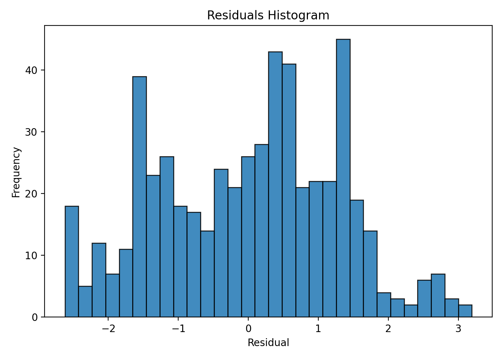
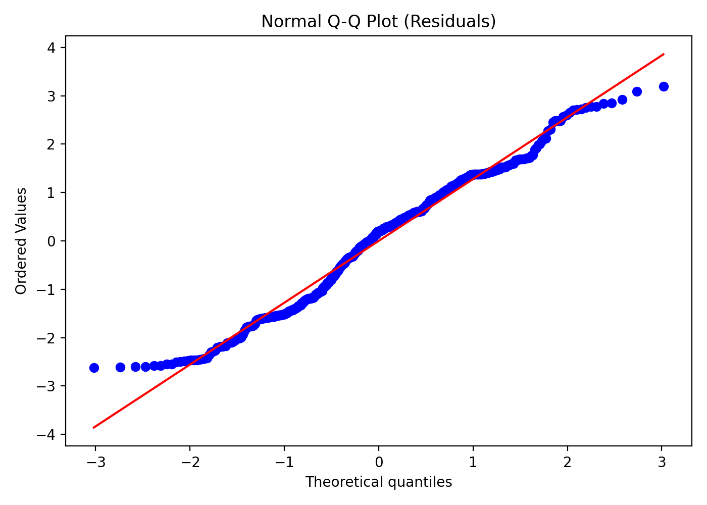
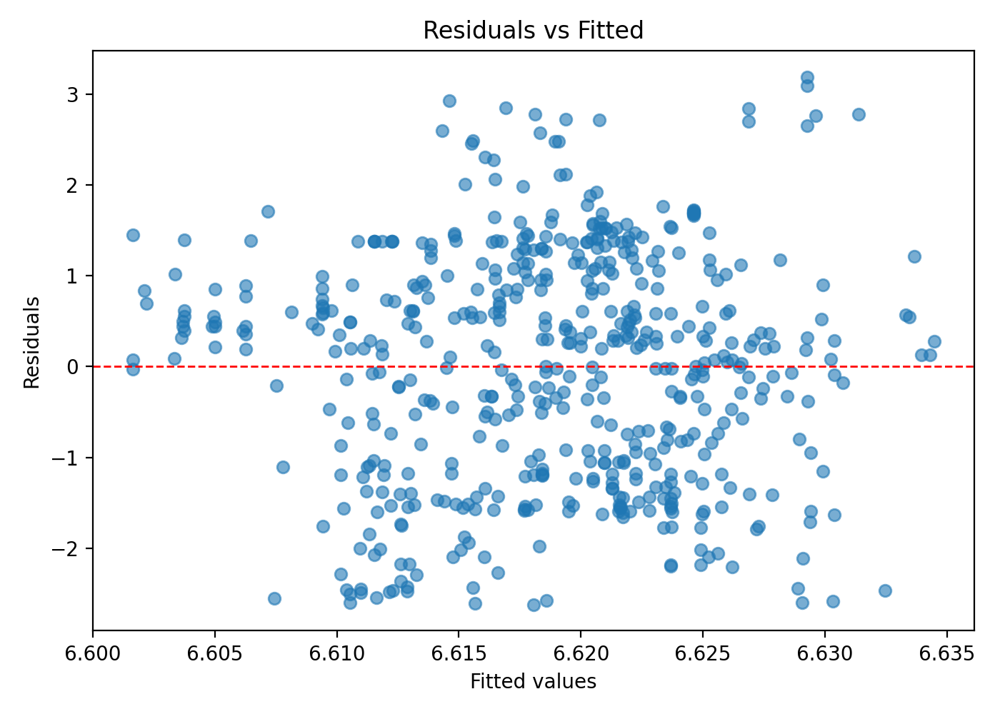

# Modeling human Carbonic Anhydrase II pIC50 using AlogP.

The goal of this project is to model **pIC50** (inhibitory activity) using the molecular descriptor **AlogP**, and to assess whether this model can be used to estimate the inhibitory activity of new compounds.

Experimentally measuring pharmacological activity across hundreds or thousands of compounds is expensive and time-consuming due to the complexity of bioassays. For early-stage prioritization, it can be helpful to explore whether **physicochemical properties** can provide a fast proxy signal for activity. One widely used and accessible property is **logP** (octanol/water partition coefficient), which reflects how hydrophobic a compound is and can be measured experimentally or computed theoretically.

The dataset used in this project is a table of experimentally measured inhibitory activities for a set of molecules. In addition to activity values, it contains molecular descriptors and assay-related metadata.

**Key takeaway:** AlogP-only is not a useful predictor of CAII pIC50 under a linear model.  
**Next step:** Expand the feature set and/or use non-linear models—AlogP alone is best treated as a baseline.

---

## Summary

To quantify the relationship between **pIC50** and **AlogP**, this project uses **simple linear regression (OLS)** and focuses on the following metrics:

- **Metric 1 — Explanatory power (R² / Adjusted R²)**
  - R² = **0.000025** (≈ 0)
  - Adjusted R² = **-0.001823** (negative)
  - Interpretation: AlogP explains essentially none of the variability in pIC50; the model does not improve over a mean-only baseline.

- **Metric 2 — Statistical significance of the descriptor (slope, p-value, 95% CI)**
  - β(AlogP) = **0.0032**
  - p-value = **0.908**
  - 95% CI = **[-0.051, 0.058]**
  - Interpretation: there is no statistical evidence that AlogP contributes useful linear signal for predicting pIC50 in this dataset.

- **Metric 3 — Prediction error (RMSE)**
  - RMSE = **1.286**
  - Interpretation: the typical error is large, and because fitted values vary very little, the model behaves like a near-constant predictor.

- **Metric 4 — Global model test (F-test)**
  - F-statistic = **0.0135**
  - Prob(F-statistic) = **0.908**
  - Interpretation: the AlogP model is not better than the null model (intercept-only).

**Overall conclusion:** For this curated CAII dataset, **AlogP alone does not provide predictive value** for pIC50 under a linear model.

---

## Recommendations
- **Do not use AlogP as the only descriptor** to model CAII pIC50: the slope is non-significant and R² is effectively zero.
- **Treat this project as a strong negative baseline** and use it to justify adding more information (features) and/or model capacity.
- **Test non-linear relationships** (e.g., polynomial regression, splines/GAM), since lipophilicity–activity relationships are often not strictly linear.
- **Add complementary descriptors** (e.g., MW, TPSA, HBD/HBA, rotatable bonds, aromaticity) and compare performance against the baseline.
- If expanding the project, **report out-of-sample performance** (train/test split or cross-validation). For chemical generalization, consider scaffold-based splitting.

---

## Notebooks

- **01 — Data curation and preprocessing**  
  [`notebooks/01_data_curation.ipynb`](notebooks/01_data_curation.ipynb)  
  - Source: ChEMBL target **Carbonic Anhydrase II (CHEMBL205)**  
  - Filters applied for consistency:
    - Standard type: **IC50**
    - Standard units: **nM**
    - Standard relation: **"="** (exclude <, >, ~)
    - Target organism: **Homo sapiens**
  - Cleanup: duplicates, inconsistencies, and extreme records removed  
  - Final dataset: **n = 543** (from 1215 initial observations)

- **02 — OLS model + baseline framing**  
  [`notebooks/02_ols_baseline.ipynb`](notebooks/02_ols_baseline.ipynb)  
  - OLS fit: `pIC50 ~ AlogP`  
  - Metrics: β, 95% CI, p-value, R² / Adjusted R², RMSE, F-test  
  - Interpretation relative to an intercept-only (mean) baseline

- **03 — Diagnostics (residual analysis)**  
  [`notebooks/03_diagnostics.ipynb`](notebooks/03_diagnostics.ipynb)  
  - Residuals vs fitted values  
  - Residual histogram  
  - Q–Q plot

---

## Plots to share findings with a team in a more "didactic" way

**Residuals histogram**  

**Normal Q–Q plot (residuals)**  

**Residuals vs fitted values**  

---

## Technical process

### Data treatment and curation
- Target selection: **Carbonic Anhydrase II (CHEMBL205)**.
- Consistency filters:
  - IC50 in nM
  - relation "=" (no censored values like <, >, ~)
  - organism: Homo sapiens
- Cleanup:
  - remove duplicates
  - remove inconsistent and extreme values
- Result:
  - **1215 → 543** observations after curation.

### Tools used
- **Python** for modeling and diagnostics (e.g., `pandas`, `statsmodels`, `matplotlib`).
- **R** for cross-checking the regression fit (via `lm()`).
- **Excel** for an additional sanity check of regression outputs.
- **ChEMBL** as the bioactivity data source.

## Author
M. Osvaldo Hernández Montoya
