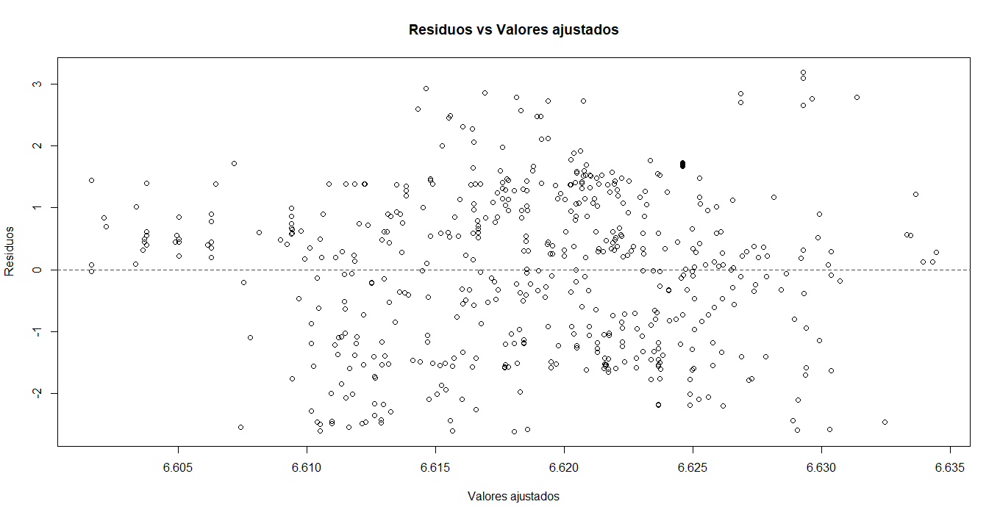
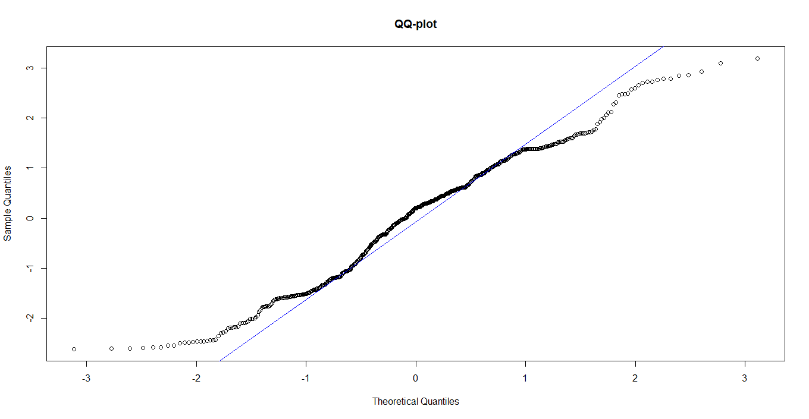
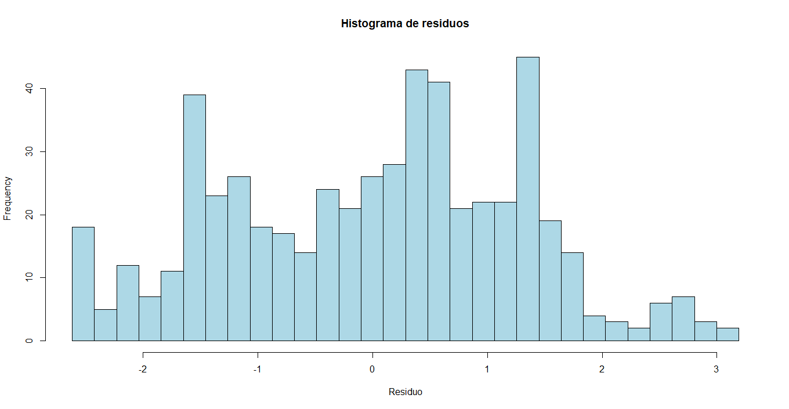

# Modeling pIC50 for Carbonic Anhydrase II (ChEMBL205) using AlogP — an honest baseline

**Goal:** Build a clean, reproducible data science workflow to test whether **AlogP** (lipophilicity) explains inhibitory activity (**pIC50**) for **Carbonic Anhydrase II**.

This repo is designed as a **portfolio project**: it highlights **data curation**, a **baseline model**, and **clear interpretation** of results.

📄 Full report (Spanish): `reports/reporte_P1.pdf`

---

## Executive summary
- After curation and deduplication, the dataset is reduced to one row per compound.
- A simple **OLS** regression (`pIC50 ~ AlogP`) shows **near-zero explanatory power** (R² ≈ 0).
- Diagnostics indicate no major violations of OLS assumptions, but the model has **no practical predictive value**.

---

## Key figures (diagnostics)





---

## Repository structure
- **Main workflow (Python):**
  - Notebooks: `notebooks/`
  - Scripts: `python/src/`
- **Raw data:** `data/raw/chembl_CAII_IC50.csv`
- **Derived data:** `data/processed/ca2_curated.csv` (generated)
- **Outputs:**
  - Model: `results/ols_summary.txt`, `results/ols_metrics.csv`, `results/ols_params.csv`
  - Figures: `figures/residuals_vs_fitted.png`, `figures/qqplot.png`, `figures/residuals_hist.png`
- **Validation (R):** `r/` (cross-check scripts)

---

## Quickstart (Python)
Create the conda environment:

```bash
conda env create -f python/environment.yml
conda activate ca2-pic50
```

Run the pipeline:

```bash
python python/src/01_curate_data.py
python python/src/02_fit_ols.py
python python/src/03_diagnostics.py
```

---

## Notebooks (recommended for reading)
Open and run in order:
1. `notebooks/01_data_curation.ipynb`
2. `notebooks/02_ols_baseline.ipynb`
3. `notebooks/03_diagnostics.ipynb`

---

## Notes on data
This repository includes the raw CSV export used in the analysis.
If you generate a different export from ChEMBL, make sure the expected columns exist:
`Molecule ChEMBL ID`, `Assay Organism`, `pChEMBL Value`, `AlogP`, `Molecular Weight`.

---

## Author
Osvaldo Hernández Montoya
